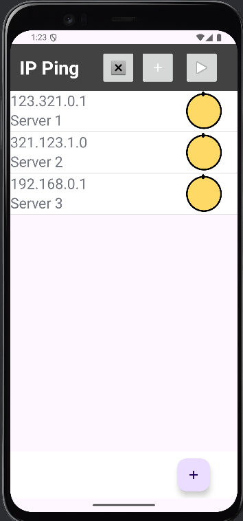
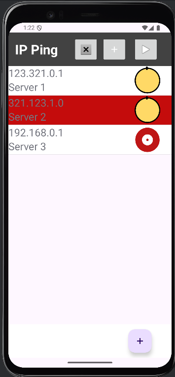
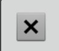

# Android-IP-ping-app
Android app for pinging IP addresses

## Tools used
1. Android Studio 2024.3.1
2. Android SDK API 35 (Android 15)
3. Java 11

## Instructions
Used to check if a server can be pinged from your android device. 
**Application** 
  

**IP List item** 
 
Each item is clickable and has the IP address, the name of the IP address and a visual que on the IP's ping status on the right side. 
**Loading image** 
 
This image symbolizes that the IP has not been tested. When the item is clicked the image will start to rotate and will change, once the ping is completed. 
**OK image** 
 
The green OK image is used to indicate, that the ping has been successful. 
**BAD image** 
 
If the ping was not successful, the bad image will be shown  
If you have many IP addresses to test, you can test all of them with one button at the top: 
  
If you wish to add a new IP address, you can press the **+** button on the bottom right to call a new menu: 
 

To delete a list item(s), simply hold the item to hightlited it: 
 

And click on the Delete button at the top: 
 

To add multiple list entries, you can use the add button at the top: 
 
This button will prompt you to choose a file with the list in a JSON format. An example of the list can be found in IP List JSON.txt file. JSON string must be in one line.